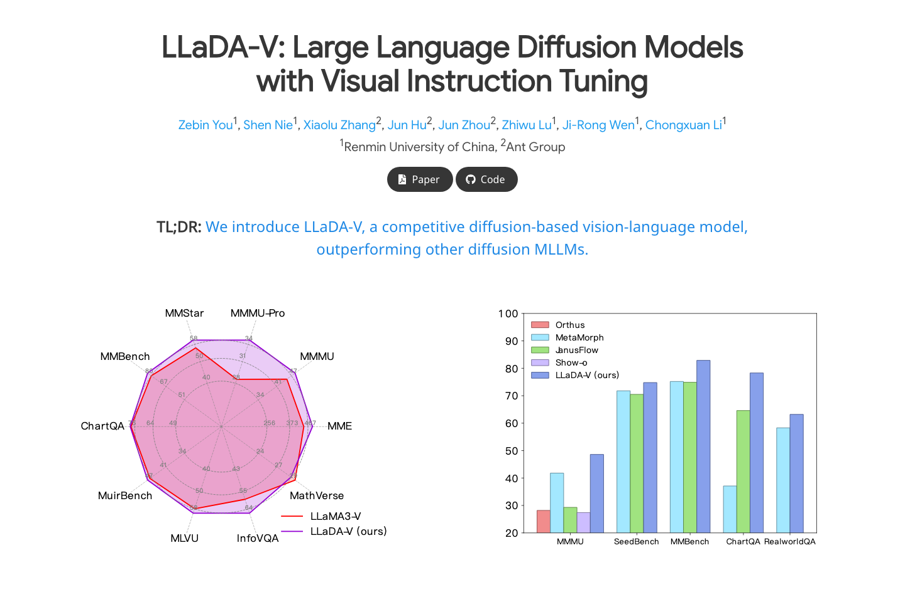

# LLaDA-V-Unofficial

<div align="center">

**Unofficial PyTorch Reproduction of**  
# LLaDA-V: Large Language Diffusion Models with Visual Instruction Tuning

[CVPR 2026 / arXiv 2025]  
   

[Paper](https://arxiv.org/abs/2505.16933) · [Project / Reference](https://ml-gsai.github.io/LLaDA-V-demo/) · [Issues](https://github.com/StaryMoon/LLaDA-V-Unofficial/issues)

</div>

> This is an **unofficial** implementation maintained by [@StaryMoon](https://github.com/StaryMoon). If this repository helps your reading, reproduction, or course project, please consider giving it a star and following my GitHub profile.

## Paper / Project Preview

<p align="center">
  
</p>

<sub>Image source: public paper/project page screenshot, [Project / Reference](https://ml-gsai.github.io/LLaDA-V-demo/). Captured/organized on 2026-07-02. This repository is unofficial and is not affiliated with the paper authors.</sub>

## At a Glance

| Item | Details |
|---|---|
| Paper | LLaDA-V: Large Language Diffusion Models with Visual Instruction Tuning |
| Venue / Source | CVPR 2026 / arXiv 2025 |
| Focus | This repository organizes a PyTorch implementation for LLaDA-V: Large Language Diffusion Models with Visual Instruction Tuning, focusing on diffusion-based multimodal large lang... |
| Repository type | Unofficial PyTorch reproduction starter |
| Local entry point | `python scripts/smoke_test.py` |


## News

- **2026-06-10**: Initial public release with model interfaces, configuration, smoke test, and reproduction roadmap.

## Overview

This repository organizes a PyTorch implementation for **LLaDA-V: Large Language Diffusion Models with Visual Instruction Tuning**, focusing on diffusion-based multimodal large language model with visual instruction tuning. The codebase is structured like a standard research repository so that each paper component can be replaced, tested, and extended independently.

Main goals:

- provide a clean PyTorch module layout for the paper;
- keep training, inference, evaluation, and configuration entry points explicit;
- track paper-reported metrics separately from local reproduction logs;
- make it easy for contributors to fill in missing paper-specific details.

## Repository Structure

```text
LLaDA-V-Unofficial/
├── configs/
│   └── default.yaml
├── scripts/
│   └── smoke_test.py
├── src/lladav_unofficial/
│   ├── __init__.py
│   └── model.py
├── README.md
├── requirements.txt
└── pyproject.toml
```

## Installation

```bash
git clone https://github.com/StaryMoon/LLaDA-V-Unofficial.git
cd LLaDA-V-Unofficial
python -m venv .venv
source .venv/bin/activate
pip install -r requirements.txt
```

For CUDA-enabled experiments, install the PyTorch build matching your CUDA version from the official PyTorch website before installing the rest of the dependencies.

## Quick Check

Run the minimal forward-pass check:

```bash
python scripts/smoke_test.py
```

Expected output:

```text
output: (...)
loss: ...
```

This confirms that the package import path, model interface, and tensor flow are working.

## Data Preparation

Create a local data directory:

```bash
mkdir -p data checkpoints outputs
```

Recommended layout:

```text
data/
├── train/
├── val/
└── test/
```

Dataset-specific converters will be added under `scripts/` as the reproduction becomes more complete. Please do not commit private datasets, downloaded checkpoints, or generated outputs.

## Training

Current minimal module usage:

```python
import torch
from lladav_unofficial import StarterConfig, UnofficialModel, reconstruction_loss

config = StarterConfig(hidden_dim=128, num_layers=2, num_heads=4)
model = UnofficialModel(config)
optimizer = torch.optim.AdamW(model.parameters(), lr=1e-4)

x = torch.randn(2, 3, 64, 64)
token_ids = torch.randint(0, config.vocab_size, (2, 8))
target = torch.zeros(2, config.output_dim)

pred = model(x, token_ids=token_ids)
loss = reconstruction_loss(pred, target)
loss.backward()
optimizer.step()
```

Full training scripts will be added as paper-specific datasets and loss terms are implemented.

## Inference

```python
import torch
from lladav_unofficial import UnofficialModel

model = UnofficialModel().eval()
with torch.no_grad():
    x = torch.randn(1, 3, 64, 64)
    y = model(x)
print(y.shape)
```

## Evaluation

Planned evaluation entry points:

```bash
python scripts/smoke_test.py
# future:
# python scripts/evaluate.py --config configs/default.yaml --ckpt checkpoints/model.pt
```

Metrics and protocols will follow the original paper as closely as possible. Paper-reported values and local reproduction values should be kept in separate columns.

## Paper Results

For copyright and license clarity, this repository links to the original paper figures and tables instead of redistributing screenshots copied from the PDF. The table below tracks the paper-reported result locations so readers can quickly compare against future local logs.

| Result Type | Paper Location | Source |
|---|---|---|
| Main quantitative comparison | Main paper tables | Original paper / project page |
| Ablation study | Ablation section | Original paper / project page |
| Qualitative examples | Main paper figures and supplement | Original paper / project page |

## Reproduction Log

| Date | Config | Dataset Split | Metric | Value | Notes |
|---|---|---|---:|---:|---|
| 2026-06-10 | `configs/default.yaml` | smoke check | forward pass | ok | package interface validation |

## Implementation Status

- [x] Package layout and install metadata
- [x] Core PyTorch module interfaces
- [x] Config file and smoke test
- [ ] Dataset-specific preprocessing
- [ ] Paper-specific losses and heads
- [ ] Training script
- [ ] Evaluation script
- [ ] Model zoo / checkpoints
- [ ] Reproduction logs

## Model Zoo

| Model | Checkpoint | Config | Notes |
|---|---|---|---|
| default | TBA | `configs/default.yaml` | compact implementation interface |

## Citation

If you find this repository useful, please cite the original paper:

```bibtex
@article{lladavunofficial,
  title = {LLaDA-V: Large Language Diffusion Models with Visual Instruction Tuning},
  author = {Zebin You, Shen Nie, Xiaolu Zhang, Jun Hu, Jun Zhou, Zhiwu Lu, Ji-Rong Wen, Chongxuan Li},
  year = {2025},
  note = {CVPR 2026 / arXiv 2025}
}
```

## Acknowledgements

- Thanks to the authors of **LLaDA-V: Large Language Diffusion Models with Visual Instruction Tuning** for the original research.
- This repository is inspired by standard open-source PyTorch research codebases.
- The implementation is unofficial and all paper names, datasets, and trademarks belong to their respective owners.

## License

This repository is released under the MIT License. The original paper, datasets, official code, and project assets remain governed by their own licenses.

## Keywords

mllm, diffusion-language-model, visual-instruction-tuning, multimodal, pytorch, cvpr-2026, unofficial-pytorch, reproduction
